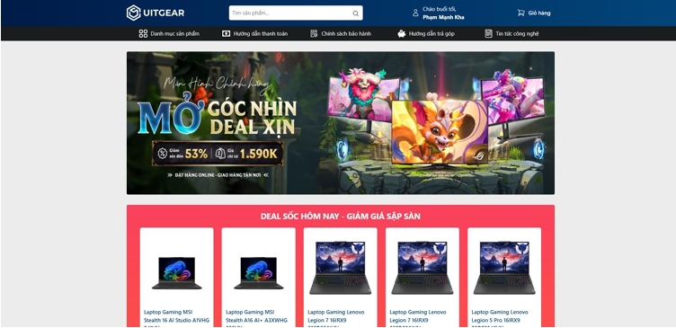
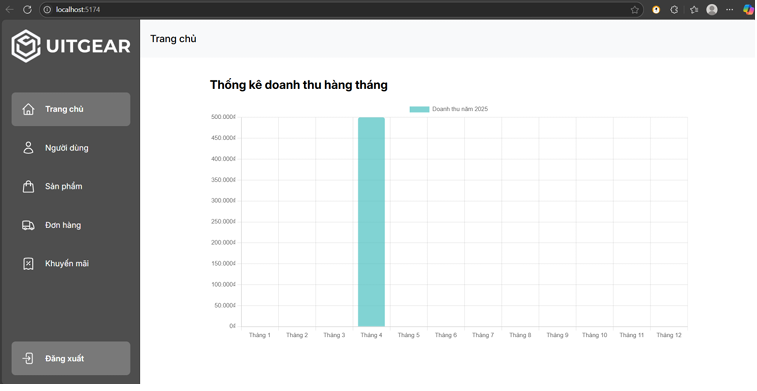

# 🔥 UITGear - Laptop và phụ kiện công nghệ
## 🙏 Giới thiệu
Đây là đồ án cuối kì môn IE213 - Kĩ thuật phát triển hệ thống Web với đề tài "TRANG WEB THƯƠNG MẠI ĐIỆN TỬ UITGEAR – LAPTOP VÀ PHỤ KIỆN CÔNG NGHỆ" 
## 🎯 Mục tiêu
Đáp ứng được nhu cầu ngày càng lớn của người dùng về trang web thương mại điện tử cho lĩnh vực công nghệ và điện tử ## 🔧 Tính năng chính
- **Đăng kí, đăng nhập.**

- **Xem thông tin chi tiết sản phẩm**

- **Đặt hàng, thanh toán**

- **Cập nhật thông tin cá nhân**

- **Truy cập giỏ hàng**

- **Xem thông tin đơn hàng**

- **Quản lí người dùng, đơn hàng, sản phẩm**

## 🔧 Công nghệ sử dụng 
- React JS
- React Bootstrap 
- NodeJS ( Express ) 
- MongoDB
## 🖼️ Một số hình ảnh

### 🔹 Trang chủ
<p align="center">
  
</p>

---

### 🔹 Trang Admin
<p align="center">
  
</p>

## 📖 Cách sử dụng 
### 1. Yêu cầu hệ thống
- Node.js (phiên bản mới nhất)
- MongoDB
- Git
- Thiết bị di động hoặc trình giả lập phù hợp
### 2. Cách cài đặt
1. Clone repository:
   ```bash
   git clone https://github.com/Hatsuki9813/UITGear_IE213.git
   ```
2. Cài đặt các thư viện cần thiết:
   ```bash
   cd frontend
   npm install
   cd backend
   npm install
   cd admin
   npm install
   ```
3. Chạy dự án:
   ```bash
   cd backend
   npm run dev
   cd frontend
   npm run dev
   cd admin
   npm run dev
   ```
4. Mở dự án trên trình duyệt
## ⚡Phương hướng phát triển 
- Tối ưu hóa hiệu suất và khả năng xử lý: Nâng cấp hạ tầng kỹ thuật của ứng dụng  để đảm bảo tốc độ tải nhanh và khả năng xử lý ổn định
- Cải thiện cơ sở dữ liệu: Cải thiện cơ sở dữ liệu cho các sản phẩm
- Bổ sung các tính năng cá nhân hóa giao diện người dùng: chế độ tối, thay đổi phông chữ, ...
## 📌Góp ý 
Nếu có thắc mắc nào, liên hệ chúng tôi

Email: 22520600@gm.uit.edu.vn 22521299@gm.uit.edu.vn

